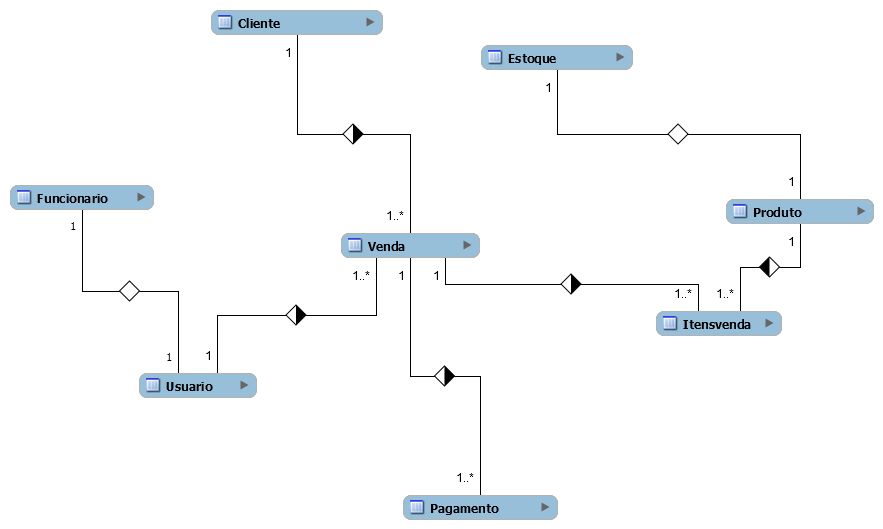
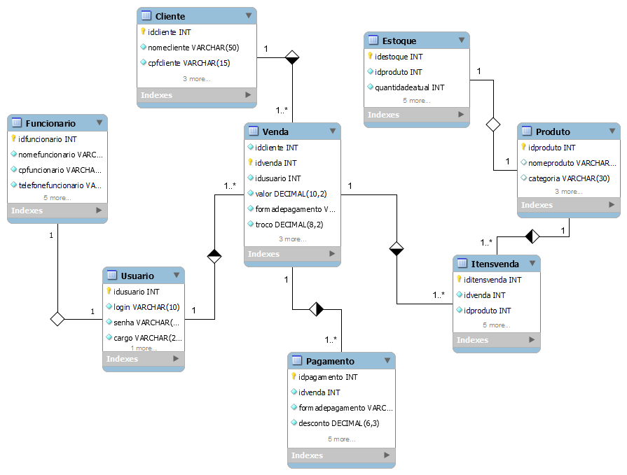

# Estudo de Caso
## O caso da Casa Oliveira

Casa Oliveira
Roberto é dono de um mercado no bairro de Vargem Grande, na cidade de 
Tupã. Ele herdou o negócio de seu pai, Gumercindo Oliveira, ela foi aberta em 
1978 na garagem da casa da família, era uma pequena quitanda. Com o passar 
dos anos o negócio cresceu e Gumercindo foi obrigado a ir para outro ponto 
maior e ali permaneceu até os dias atuais.


Roberto, que agora é o novo dono do mercado continuou o negócio seguindo 
da mesma forma que o pai. Ele comprava diretamente com os fornecedores 
grandes volumes de produtos e armazenava em seu estoque. As vezes ele 
comprava muitos produtos que ainda havia em estoque causando uma 
sobrecarga de produtos, ele também tinha muitos produtos estragados, tais 
como: frutas, legumes, iogurtes, leites, frango etc. Também havia muitos 
produtos com o prazo de validade vencido.


Os funcionários eram poucos e faziam muitas coisas ao mesmo tempo. O 
açougueiro também ajudava no estoque, a moça da limpeza ajudava na 
organização dos produtos das prateleiras, além de ajudar na padaria, quanto o 
caixa estava vazio o operador ajudava a repor os laticínios e a limpar a loja. O 
repositor também fazia operação no caixa.


Ao realizar a venda o Roberto, que sabia o nome de quase todos os clientes, 
anotava em um caderno todos os produtos que vendia e que havia em estoque. 
Ao fim do dia , Roberto pegava o caderno de fazia os cálculos de o quanto 
havia vendido, somando o faturamento e realizando a atualização do estoque. 
Isso é feito todos os dias e toma um tempo considerável para que tudo seja 
feito.


Roberto fechava a loja as 18h, mas só ia para casa as 22h, após fazer todas as 
operações necessárias. Mesmo assim o negócio vai bem e Roberto pretende ir 
para outro ponto e aumentar o volume de negócios e contratar novos 
funcionários.
Marica, esposa de Roberto, vem conversando com ele há muito tempo para que 
ele contrate uma empresa para construir um sistema de informática para 
gerenciar o negócio e reduzir o tempo que ele passa trabalhando e tenha maior 
organização dos produtos, maior lucratividade e melhorar a gestão.


Com a intenção de aumentar o negócio, Roberto está disposto a informatizar 
sua empresa. Vamos ajudá-lo. Iremos começar construindo o banco de dados.

### Com base no estudo de caso acima, foi construido um modelo conceitual para desenvolvimentode um banco de dados queatenda a Casa Oliveira

### Modelo conceitual


### Modelo Lógico


### Código SQL para o modelo físico do banco de dados

```sql
-- MySQL Workbench Forward Engineering

SET @OLD_UNIQUE_CHECKS=@@UNIQUE_CHECKS, UNIQUE_CHECKS=0;
SET @OLD_FOREIGN_KEY_CHECKS=@@FOREIGN_KEY_CHECKS, FOREIGN_KEY_CHECKS=0;
SET @OLD_SQL_MODE=@@SQL_MODE, SQL_MODE='ONLY_FULL_GROUP_BY,STRICT_TRANS_TABLES,NO_ZERO_IN_DATE,NO_ZERO_DATE,ERROR_FOR_DIVISION_BY_ZERO,NO_ENGINE_SUBSTITUTION';

-- -----------------------------------------------------
-- Schema mydb
-- -----------------------------------------------------

-- -----------------------------------------------------
-- Schema mydb
-- -----------------------------------------------------
CREATE SCHEMA IF NOT EXISTS `mydb` DEFAULT CHARACTER SET utf8 ;
SHOW WARNINGS;
USE `mydb` ;

-- -----------------------------------------------------
-- Table `mydb`.`Usuario`
-- -----------------------------------------------------
CREATE TABLE IF NOT EXISTS `mydb`.`Usuario` (
  `idusuario` INT NOT NULL AUTO_INCREMENT,
  `login` VARCHAR(10) NOT NULL,
  `senha` VARCHAR(200) NOT NULL,
  `cargo` VARCHAR(20) NOT NULL,
  `criadoem` DATETIME NOT NULL,
  PRIMARY KEY (`idusuario`),
  UNIQUE INDEX `login_UNIQUE` (`login` ASC) VISIBLE)
ENGINE = InnoDB;

SHOW WARNINGS;

-- -----------------------------------------------------
-- Table `mydb`.`Funcionario`
-- -----------------------------------------------------
CREATE TABLE IF NOT EXISTS `mydb`.`Funcionario` (
  `idfuncionario` INT NOT NULL AUTO_INCREMENT,
  `nomefuncionario` VARCHAR(50) NOT NULL,
  `cpfuncionario` VARCHAR(15) NOT NULL,
  `telefonefuncionario` VARCHAR(15) NOT NULL,
  `emailfuncionario` VARCHAR(100) NOT NULL,
  `cargofuncionario` VARCHAR(20) NOT NULL,
  `expediente` VARCHAR(50) NOT NULL,
  `Funcionariocol` DATE NOT NULL,
  `idusuario` INT NOT NULL,
  PRIMARY KEY (`idfuncionario`, `idusuario`),
  UNIQUE INDEX `cpfuncionario_UNIQUE` (`cpfuncionario` ASC) VISIBLE,
  UNIQUE INDEX `emailfuncionario_UNIQUE` (`emailfuncionario` ASC) VISIBLE,
  INDEX `fk_Funcionario_Usuario_idx` (`idusuario` ASC) VISIBLE,
  CONSTRAINT `fk_Funcionario_Usuario`
    FOREIGN KEY (`idusuario`)
    REFERENCES `mydb`.`Usuario` (`idusuario`)
    ON DELETE NO ACTION
    ON UPDATE NO ACTION)
ENGINE = InnoDB;

SHOW WARNINGS;

-- -----------------------------------------------------
-- Table `mydb`.`Cliente`
-- -----------------------------------------------------
CREATE TABLE IF NOT EXISTS `mydb`.`Cliente` (
  `idcliente` INT NOT NULL AUTO_INCREMENT,
  `nomecliente` VARCHAR(50) NOT NULL,
  `cpfcliente` VARCHAR(15) NOT NULL,
  `telefonecliente` VARCHAR(15) NOT NULL,
  `emailcliente` VARCHAR(100) NOT NULL,
  `datanascimentocliente` DATE NULL,
  PRIMARY KEY (`idcliente`))
ENGINE = InnoDB;

SHOW WARNINGS;

-- -----------------------------------------------------
-- Table `mydb`.`Produto`
-- -----------------------------------------------------
CREATE TABLE IF NOT EXISTS `mydb`.`Produto` (
  `idproduto` INT NOT NULL,
  `nomeproduto` VARCHAR(50) NULL,
  `categoria` VARCHAR(30) NULL,
  `descriçao` TEXT NULL,
  `precounitario` DECIMAL NULL,
  `datavalidade` DATE NULL,
  PRIMARY KEY (`idproduto`))
ENGINE = InnoDB;

SHOW WARNINGS;

-- -----------------------------------------------------
-- Table `mydb`.`Venda`
-- -----------------------------------------------------
CREATE TABLE IF NOT EXISTS `mydb`.`Venda` (
  `idcliente` INT NOT NULL,
  `idvenda` INT UNSIGNED NOT NULL,
  `idusuario` INT NOT NULL,
  `valor` DECIMAL(10,2) NOT NULL,
  `formadepagamento` VARCHAR(30) NOT NULL,
  `troco` DECIMAL(8,2) NOT NULL,
  `datahoravenda` DATETIME NOT NULL,
  `idcliente` INT NOT NULL,
  `idusuario` INT NOT NULL,
  PRIMARY KEY (`idvenda`, `idcliente`, `idusuario`),
  INDEX `fk_Venda_Cliente1_idx` (`idcliente` ASC) VISIBLE,
  INDEX `fk_Venda_Usuario1_idx` (`idusuario` ASC) VISIBLE,
  CONSTRAINT `fk_Venda_Cliente1`
    FOREIGN KEY (`idcliente`)
    REFERENCES `mydb`.`Cliente` (`idcliente`)
    ON DELETE NO ACTION
    ON UPDATE NO ACTION,
  CONSTRAINT `fk_Venda_Usuario1`
    FOREIGN KEY (`idusuario`)
    REFERENCES `mydb`.`Usuario` (`idusuario`)
    ON DELETE NO ACTION
    ON UPDATE NO ACTION)
ENGINE = InnoDB;

SHOW WARNINGS;

-- -----------------------------------------------------
-- Table `mydb`.`Itensvenda`
-- -----------------------------------------------------
CREATE TABLE IF NOT EXISTS `mydb`.`Itensvenda` (
  `iditensvenda` INT NOT NULL AUTO_INCREMENT,
  `idvenda` INT NOT NULL,
  `idproduto` INT NOT NULL,
  `precoproduto` DECIMAL(10,2) NOT NULL,
  `quantidadedeitem` INT NOT NULL,
  `subtotal` DECIMAL(10,2) NOT NULL,
  `idproduto` INT NOT NULL,
  `idvenda` INT UNSIGNED NOT NULL,
  PRIMARY KEY (`iditensvenda`, `idproduto`, `idvenda`),
  INDEX `fk_Itensvenda_Produto1_idx` (`idproduto` ASC) VISIBLE,
  INDEX `fk_Itensvenda_Venda1_idx` (`idvenda` ASC) VISIBLE,
  CONSTRAINT `fk_Itensvenda_Produto1`
    FOREIGN KEY (`idproduto`)
    REFERENCES `mydb`.`Produto` (`idproduto`)
    ON DELETE NO ACTION
    ON UPDATE NO ACTION,
  CONSTRAINT `fk_Itensvenda_Venda1`
    FOREIGN KEY (`idvenda`)
    REFERENCES `mydb`.`Venda` (`idvenda`)
    ON DELETE NO ACTION
    ON UPDATE NO ACTION)
ENGINE = InnoDB;

SHOW WARNINGS;

-- -----------------------------------------------------
-- Table `mydb`.`Estoque`
-- -----------------------------------------------------
CREATE TABLE IF NOT EXISTS `mydb`.`Estoque` (
  `idestoque` INT NOT NULL AUTO_INCREMENT,
  `idproduto` INT NOT NULL,
  `quantidadeatual` INT NOT NULL,
  `quantidademaxima` INT NOT NULL,
  `quantidademinima` INT NOT NULL,
  `ultimaatualizacao` DATETIME NOT NULL,
  `observaçao` TEXT NOT NULL,
  `idproduto` INT NOT NULL,
  PRIMARY KEY (`idestoque`, `idproduto`),
  INDEX `fk_Estoque_Produto1_idx` (`idproduto` ASC) VISIBLE,
  CONSTRAINT `fk_Estoque_Produto1`
    FOREIGN KEY (`idproduto`)
    REFERENCES `mydb`.`Produto` (`idproduto`)
    ON DELETE NO ACTION
    ON UPDATE NO ACTION)
ENGINE = InnoDB;

SHOW WARNINGS;

-- -----------------------------------------------------
-- Table `mydb`.`Pagamento`
-- -----------------------------------------------------
CREATE TABLE IF NOT EXISTS `mydb`.`Pagamento` (
  `idpagamento` INT NOT NULL AUTO_INCREMENT,
  `idvenda` INT NOT NULL,
  `formadepagamento` VARCHAR(30) NOT NULL,
  `desconto` DECIMAL(6,3) NOT NULL,
  `situaçaopagamento` VARCHAR(20) NOT NULL,
  `parcelas` INT NOT NULL,
  `valorparcela` DECIMAL(10,2) NOT NULL,
  `observaçao` TEXT NOT NULL,
  `idvenda` INT UNSIGNED NOT NULL,
  PRIMARY KEY (`idpagamento`, `idvenda`),
  INDEX `fk_Pagamento_Venda1_idx` (`idvenda` ASC) VISIBLE,
  CONSTRAINT `fk_Pagamento_Venda1`
    FOREIGN KEY (`idvenda`)
    REFERENCES `mydb`.`Venda` (`idvenda`)
    ON DELETE NO ACTION
    ON UPDATE NO ACTION)
ENGINE = InnoDB;

SHOW WARNINGS;

SET SQL_MODE=@OLD_SQL_MODE;
SET FOREIGN_KEY_CHECKS=@OLD_FOREIGN_KEY_CHECKS;
SET UNIQUE_CHECKS=@OLD_UNIQUE_CHECKS;

```